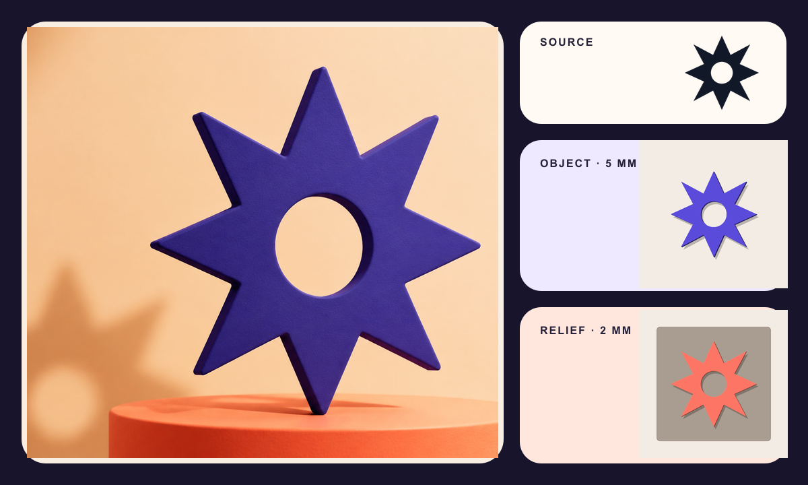

<div align="center">

# Creator Brand Skills

### Four open-source Agent Skills for turning product inputs into finished brand assets.

Clay logo renders and OBJ meshes · transparent PNG stickers · editable SVG
icon families · reusable product mascots

[](https://github.com/AlbertAZ1992/creator-brand-skills/actions/workflows/verify.yml)
[](LICENSE)
[](#four-skills-one-production-toolkit)

**English** · [简体中文](README.zh-CN.md) · [Install](#install) ·
[Outputs](#what-you-actually-get) · [Verify](#verify-locally)

</div>

## Four Skills, one production toolkit

| **01 · Logo to Clay** | **02 · Image to Sticker** |
| :---: | :---: |
|  |  |
| One mark → clay render + standalone OBJ + relief | One artwork → eight inspectable contour and material results |
| [`$logo-to-clay`](logo-to-clay/) | [`$image-to-sticker`](image-to-sticker/) |

| **03 · Feature to Icons** | **04 · Product to Mascot** |
| :---: | :---: |
|  |  |
| One product story → 3–20 verified SVG icons | One character bible → five recognisable working poses |
| [`$feature-to-icons`](feature-to-icons/) | [`$product-to-mascot`](product-to-mascot/) |

These are comparison boards, not isolated beauty shots: each one makes the
range, consistency, and production route visible before installation. Every
source logo, illustration, product identity, and mascot is original to this
repository—no third-party brand or trademark is needed for the demos.

Marketing boards remain separate from clean deliverables and machine-checkable
proof. Every board is built from outputs produced by the route its Skill
documents.

## Start with one sentence

| Goal | Paste into Codex |
| --- | --- |
| Make a clay logo | `Use $logo-to-clay to turn this logo into a refined clay render and OBJ mesh.` |
| Make a sticker | `Use $image-to-sticker to turn this artwork into a transparent contour sticker.` |
| Build an icon family | `Use $feature-to-icons to make consistent SVG icons for these product features.` |
| Design a mascot | `Use $product-to-mascot to turn these product facts into a reusable mascot system.` |

## What you actually get

| Skill | Inputs and visual controls | Production files |
| --- | --- | --- |
| [`logo-to-clay`](logo-to-clay/) | Simple SVG/PNG logo; image, mesh, or both; standalone object or relief; clay colour, depth, studio or transparent background | Generated raster + final prompt; OBJ, MTL, bump PNG, 1024 px preview, manifest JSON |
| [`image-to-sticker`](image-to-sticker/) | Transparent or flat-background logo, icon, badge, wordmark, or flat illustration; 0–44 px contour, custom colour, four deterministic finishes, ±12° tilt, 512/1024 px | Transparent RGBA PNG, alpha-proof PNG, reproducible source-card JSON, manifest JSON |
| [`feature-to-icons`](feature-to-icons/) | 3–20 feature names plus product context; outline light/regular/bold, filled, or duotone; custom colours; 24/32/48 px grid | Editable SVG per feature, spec and provenance JSON, SVG/PNG family preview, optical-check manifest JSON |
| [`product-to-mascot`](product-to-mascot/) | Product facts plus optional audience, personality, mascot type, visual medium, palette, or brand reference | Character-bible JSON, five full-size reference PNGs, contact sheet, verification manifest JSON |

## Why the outputs hold up

| **Source-locked** | **Production-ready** | **Verified** |
| :---: | :---: | :---: |
| Locks the supplied logo, artwork, feature meaning, or product facts before creative work starts | Returns real RGBA, SVG, OBJ/MTL, PNG, and JSON assets—not only a prompt or mockup | Runs alpha, geometry, provenance, optical, or identity checks and records the result |

```text
source truth → task spec → controlled generation
             → deterministic finishing → hard checks → proof → manifest
```

This boundary matters. The generated clay image can be expressive while the
OBJ route remains deterministic. Sticker materials can look different while
alpha geometry stays unchanged. Icon semantics stay traceable to one pinned
library family. Mascot poses vary only after the character identity is locked.

## See the breadth, then inspect the proof

| Skill | Portfolio view | Verification view |
| --- | --- | --- |
| Logo to Clay | [Clay campaign render and two 3D forms](logo-to-clay/examples/) | OBJ faces, material linkage, holes, 1024 px preview, passing manifest |
| Image to Sticker | [Contours, colours, tilt, and four front finishes](image-to-sticker/examples/) | Transparent asset, grayscale alpha proof, topology and provenance manifest |
| Feature to Icons | [Nine product families across style and weight](feature-to-icons/examples/) | One SVG per feature, pinned Phosphor source, optical metrics, zero hidden fallback |
| Product to Mascot | [Mori master reference and five-pose set](product-to-mascot/examples/) | Character bible, five full-size references, contact sheet, passing manifest |

## Install

Install from the published repository with the standard Skills CLI:

```bash
npx skills add AlbertAZ1992/creator-brand-skills
```

The interactive flow lets you choose one or more Skills, supported agents, and
installation scope. Start a new Codex task after installation.

<details>
<summary><strong>Install all four, install one, or use a Skill once</strong></summary>

```bash
# Install all four globally for Codex
npx skills add AlbertAZ1992/creator-brand-skills \
  --skill '*' --global --agent codex --yes

# List or install one Skill
npx skills add AlbertAZ1992/creator-brand-skills --list
npx skills add AlbertAZ1992/creator-brand-skills \
  --skill image-to-sticker --global --agent codex

# Run once without keeping it installed
npx skills use AlbertAZ1992/creator-brand-skills@logo-to-clay --agent codex
```

</details>

## Verify locally

```bash
./scripts/verify.sh
```

This runs lint, formatting, strict TypeScript checks, unit tests, behaviour
evals, committed-example checks, and real deliverable validation for all four
Skills. GitHub Actions runs the same package-level verification.

Requirements: Node.js 22 and npm. Regenerating every visual example also needs
ImageMagick and `jq` (`brew install imagemagick jq`). Each Skill folder owns its
`SKILL.md`, UI metadata, implementation, schemas, evals, and examples, so the
four packages remain independently installable.

## License

MIT. See [`LICENSE`](LICENSE). Package-specific third-party code notices are in
[`THIRD_PARTY_NOTICES.md`](THIRD_PARTY_NOTICES.md).
