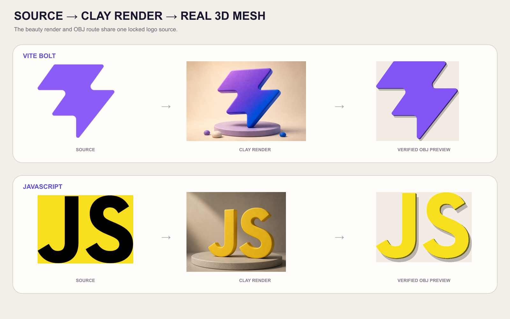
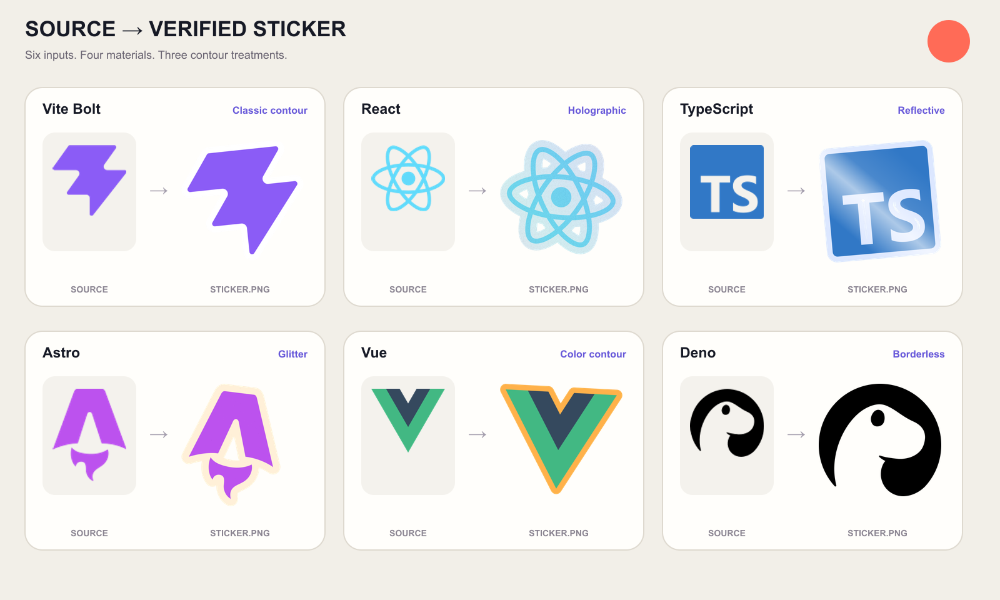
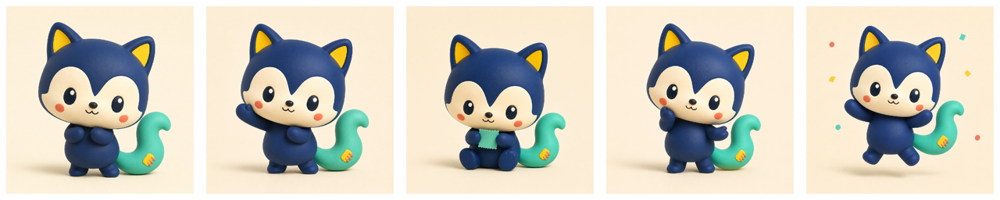
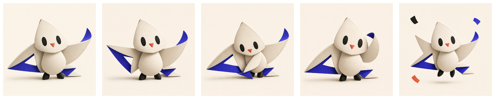

<div align="center">

# Creator Brand Skills

### 四个开源 Agent Skills，把产品输入真正做成可交付的品牌资产。

黏土 Logo 渲染与 OBJ Mesh · 透明 PNG 贴纸 · 可编辑 SVG 图标族 ·
可复用产品 Mascot

[](https://github.com/AlbertAZ1992/creator-brand-skills/actions/workflows/verify.yml)
[](LICENSE)
[](#四个-skill一套生产工具组)

[English](README.md) · **简体中文** · [安装](#安装) ·
[产物](#输入--结果--生产文件) · [验证](#本地验证)

</div>

## 四个 Skill，一套生产工具组

| **01 · Logo to Clay · 黏土渲染 + 3D Mesh** | **02 · Image to Sticker · 透明 PNG** |
| :---: | :---: |
|  |  |
| Vite + JavaScript 平面 Logo → 黏土渲染 + 真实验证 OBJ | 六张平面 Logo → 六种透明贴纸 + alpha proof |
| [`$logo-to-clay`](logo-to-clay/) | [`$image-to-sticker`](image-to-sticker/) |

| **03 · Feature to Icons · 动画 SVG 图标组** | **04 · Product to Mascot · 角色系统** |
| :---: | :---: |
|  |  |
| 20 条功能名称 → 20 枚手绘动画 SVG + 光学校验 | OpenPatch 产品事实 → Pip 角色圣经 → 五个锁定姿势 |
| [`$feature-to-icons`](feature-to-icons/) | [`$product-to-mascot`](product-to-mascot/) |

这些当前图片都同时交代输入和真实生产链路结果，不是互不相关的单张美图。
Pip 与 Azi 都是本仓库原创概念；
第三方技术标志仅作为有明确来源的转换测试素材，相关名称与标志归各自权利人
所有，本项目不暗示任何合作或背书。

### 更多已确认案例

| **JavaScript · Logo to Clay** | **ALBERTAZ · Product to Mascot** |
| :---: | :---: |
|  |  |
| 黄色主视觉 + 独立物体 + 浮雕 | 折纸燕 + 锁定身份的五姿势角色系统 |

用于展示的能力板仍与干净交付物、机器校验证据彼此分离；每块能力板都由对应
Skill 所描述的真实生产链路产物组成。

## 一句话就能开始

| 目标 | 复制到 Codex |
| --- | --- |
| 制作黏土 Logo | `Use $logo-to-clay 把这个 Logo 做成精致的黏土渲染图和 OBJ Mesh。` |
| 制作透明贴纸 | `Use $image-to-sticker 把这张图做成透明轮廓贴纸。` |
| 制作一套图标 | `Use $feature-to-icons 为这些产品功能制作一致的 SVG 图标。` |
| 设计品牌 Mascot | `Use $product-to-mascot 根据这些产品事实设计一套可复用的 Mascot。` |

## 输入 → 结果 → 生产文件

| Skill | 你提供 | 先检查这个结果 | 最后保留的文件与证明 |
| --- | --- | --- | --- |
| [`logo-to-clay`](logo-to-clay/) | 一张简单 SVG/PNG Logo，以及可选形态、颜色、深度与背景 | 锁定源轮廓且有明显侧壁的黏土主视觉；独立物体或浮雕 Mesh 预览 | 最终图片 Prompt/渲染；OBJ、MTL、凹凸 PNG、1024 px 预览、几何 manifest |
| [`image-to-sticker`](image-to-sticker/) | 一张透明或纯色背景 Logo、图标、字标、徽章或扁平插画 | 完整源图变成透明刀模贴纸；可选轮廓色、旋转与四种确定性材质 | RGBA `sticker.png`、alpha proof、可复现 source card、拓扑/来源 manifest |
| [`feature-to-icons`](feature-to-icons/) | 3–20 个功能名、产品语境，以及可选颜色、动画与样式 | 默认生成原创手绘功能图标；只有明确要求系统控件时才使用原生图标库 | 每功能独立动画 SVG、可播放 HTML、SVG/PNG 预览、规格、元数据与光学校验 manifest |
| [`product-to-mascot`](product-to-mascot/) | 产品事实，以及可选受众、性格、角色类型、视觉媒介、品牌色或现有 Logo | 三个真正不同的外轮廓，然后把选中身份扩展为五个可识别使用姿势 | V2 角色圣经、五张全尺寸 PNG、64 px 联系表检查、校验 manifest |

## 为什么这些产物经得住继续使用

| **先锁定输入** | **真的能交付** | **结果可验证** |
| :---: | :---: | :---: |
| 创作前锁定 Logo、原图、功能含义或产品事实 | 返回真实 RGBA、SVG、OBJ/MTL、PNG 和 JSON，不只是 Prompt 或 Mockup | 执行透明度、几何、来源、光学或角色一致性检查并记录结果 |

```text
源输入事实 → 任务规格 → 受控生成
           → 确定性后处理 → 硬校验 → 可视证明 → manifest
```

这个边界很重要：黏土宣传图可以有审美表达，OBJ 仍保持确定性；贴纸材质可以
改变观感，alpha 几何不变，小 viewBox SVG 仍保持清晰；系统图标保持固定版本
图标库的原生几何，品牌收益则强制使用原创定制几何与不同外轮廓；
Mascot 会先比较三个方向，再锁定 V2 角色身份并生成不同姿势。

## 先看作品范围，再看验收证据

| Skill | 作品视图 | 验收视图 |
| --- | --- | --- |
| Logo to Clay | [Vite 闪电、JavaScript 黏土主视觉与验证过的 3D 资产](logo-to-clay/examples/) | OBJ 面、材质链接、1024 px 预览、通过的 manifest |
| Image to Sticker | [经典、全息、反光、闪粉、彩色轮廓和无边框六种原图到贴纸案例](image-to-sticker/examples/) | 透明资源、灰度 alpha 证明、拓扑与来源 manifest |
| Feature to Icons | [二十枚动画手绘创作者图标](feature-to-icons/examples/) | 输入 brief 与真实 SVG、内置轻微抖动、减少动态降级、光学指标 |
| Product to Mascot | [Pip、Azi 与 Mori 三套验证过的五姿势角色](product-to-mascot/examples/) | 角色圣经、五张全尺寸参考图、contact sheet、通过的 manifest |

## 安装

通过标准 Skills CLI 从已发布仓库安装：

```bash
npx skills add AlbertAZ1992/creator-brand-skills
```

交互流程会让你选择 Skill、兼容 Agent 和安装范围。安装完成后新开一个 Codex
任务即可使用。

<details>
<summary><strong>安装全部、只装一个，或仅临时使用一次</strong></summary>

```bash
# 为 Codex 全局安装全部四个 Skill
npx skills add AlbertAZ1992/creator-brand-skills \
  --skill '*' --global --agent codex --yes

# 查看或只安装一个 Skill
npx skills add AlbertAZ1992/creator-brand-skills --list
npx skills add AlbertAZ1992/creator-brand-skills \
  --skill image-to-sticker --global --agent codex

# 仅启动一次，不保留安装
npx skills use AlbertAZ1992/creator-brand-skills@logo-to-clay --agent codex
```

</details>

## 本地验证

```bash
./scripts/verify.sh
```

它会为四个 Skill 运行 lint、格式检查、严格 TypeScript、单元测试、行为评测、
已提交示例检查和真实交付物校验。GitHub Actions 会运行同样的包级验证。

环境要求是 Node.js 22 与 npm。重建全部视觉示例还需要 ImageMagick 和 `jq`
（`brew install imagemagick jq`）。每个 Skill 目录自己维护 `SKILL.md`、UI metadata、
实现、schema、eval 与示例，因此四个包可以独立安装。

## License

MIT，见 [`LICENSE`](LICENSE)。包级第三方代码说明见
[`THIRD_PARTY_NOTICES.md`](THIRD_PARTY_NOTICES.md)。
