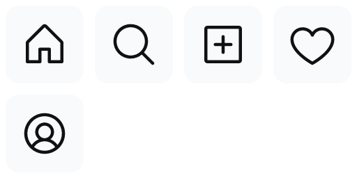

<div align="center">

# Creator Brand Skills

### 面向 Codex 的开源 AI 品牌设计 Agent Skills。

把一个 Logo、图片、功能列表或产品想法变成黏土 Logo 渲染与 OBJ Mesh、透明
PNG 贴纸、可编辑 SVG 图标族，或可复用的产品 Mascot。

[English](README.md) · **简体中文** · [安装](#安装) · [本地验证](#本地验证)

</div>

## 四个 Agent Skill，一套 AI 品牌设计工具组

| **01 · Logo to Clay** | **02 · Image to Sticker** |
| :---: | :---: |
|  |  |
| Logo 或图标 → 黏土渲染图或真实 OBJ Mesh | 平面图片 → 忠于源图的透明贴纸 |
| [`$logo-to-clay`](logo-to-clay/) | [`$image-to-sticker`](image-to-sticker/) |

| **03 · Feature to Icons** | **04 · Product to Mascot** |
| :---: | :---: |
|  |  |
| 3–20 个产品功能 → 一套一致、可编辑的 SVG 图标 | 产品事实 → 角色圣经与五张姿势参考图 |
| [`$feature-to-icons`](feature-to-icons/) | [`$product-to-mascot`](product-to-mascot/) |

作品表格使用同一个易识别的输入，方便直接比较不同转换效果。Threads 是 Meta
Platforms, Inc. 的商标；以上均为非官方演示，本项目与 Meta 无关联，也未获得其
认可或背书。

## 直接试一个 Skill

| 目标 | 复制到 Codex |
| --- | --- |
| 制作黏土 Logo | `Use $logo-to-clay 把这个 Logo 做成精致的黏土渲染图。` |
| 制作透明贴纸 | `Use $image-to-sticker 把这张图做成透明轮廓贴纸。` |
| 制作一套图标 | `Use $feature-to-icons 为这些产品功能制作一套一致的 SVG 图标。` |
| 设计品牌 Mascot | `Use $product-to-mascot 根据这些产品事实设计一个可复用的品牌 Mascot。` |

## 安装

最终用户通过标准 Skills CLI 从已发布仓库安装：

```bash
npx skills add AlbertAZ1992/creator-brand-skills
```

交互流程会让你选择 Skill、兼容 Agent 和安装范围。安装完成后新开一个 Codex
任务，复制上面的任意一句即可开始。

<details>
<summary><strong>安装全部、只装一个，或仅临时使用一次</strong></summary>

为 Codex 全局安装全部四个 Skill：

```bash
npx skills add AlbertAZ1992/creator-brand-skills \
  --skill '*' --global --agent codex --yes
```

查看可用 Skill，或只安装其中一个：

```bash
npx skills add AlbertAZ1992/creator-brand-skills --list
npx skills add AlbertAZ1992/creator-brand-skills \
  --skill image-to-sticker --global --agent codex
```

只启动一次，不保留安装：

```bash
npx skills use AlbertAZ1992/creator-brand-skills@logo-to-clay --agent codex
```

</details>

## 生成产物，一张表讲清楚

| Skill | 支持的输入 | 风格与控制项 | 最终拿到的文件 |
| --- | --- | --- | --- |
| [`logo-to-clay`](logo-to-clay/) | 简单的 SVG 或 PNG Logo | 图片、Mesh 或两者；独立物体或浮雕；棚拍或透明背景；颜色与深度 | 生成图与 Prompt；OBJ、MTL、凹凸 PNG、1024 px 预览图、manifest JSON |
| [`image-to-sticker`](image-to-sticker/) | 透明或纯色背景的 Logo、字标、图标、徽章、扁平插画 | 无边框或 0–44 px 轮廓；自定义颜色；原始、镭射、闪粉、反光材质；±12° 旋转；512/1024 px | 透明 RGBA PNG、alpha-proof PNG、可复现的 source-card JSON、manifest JSON |
| [`feature-to-icons`](feature-to-icons/) | 3–20 个功能名与可选产品语境，支持非拉丁文字标签 | 线性 light/regular/bold、填充、双色；自定义颜色；24/32/48 px 网格 | 每个功能一份可编辑 SVG、spec 与来源 JSON、SVG/PNG 图标族预览、光学校验 manifest JSON |
| [`product-to-mascot`](product-to-mascot/) | 产品事实，以及可选受众、性格、Mascot 类型、视觉媒介和品牌色 | 一套锁定的角色系统；主参考、欢迎、工作、思考、庆祝五个姿势 | 角色圣经 JSON、五张参考 PNG、contact-sheet PNG、校验 manifest JSON |

## 这套工具为什么不只是四段 Prompt

| **忠于源输入** | **真正可交付** | **结果可验证** |
| :---: | :---: | :---: |
| 转换前锁定 Logo 几何、原图、功能含义或角色身份，不静默改写 | 交付真实 RGBA、SVG、OBJ/MTL、PNG 和 JSON，而不只是一段 Prompt 或 Mockup | 执行任务专属的透明度、几何、来源、光学或角色一致性检查，并把结果写入 manifest |

四个 Skill 共享同一套交付逻辑：

```text
源输入事实 → 任务规格 → 受控生成
           → 确定性后处理 → 硬校验 → 可视证明 → manifest
```

## 本地验证

```bash
./scripts/verify.sh
```

该命令会为全部四个 Skill 运行 lint、格式检查、严格 TypeScript 检查、单元测试、
行为评测和真实交付物验证。GitHub Actions 会在 push 和 pull request 时运行同样
的包级检查。

<details>
<summary><strong>环境要求与仓库结构</strong></summary>

环境要求：

- Codex 或兼容的 Skill 运行环境
- Node.js 22 与 npm
- 完整重建所有视觉示例时需要 ImageMagick 和 `jq`

```bash
brew install imagemagick jq
```

```text
creator-brand-skills/
├── scripts/
│   ├── render-social-preview.sh
│   └── verify.sh
├── examples/
├── .github/workflows/
├── feature-to-icons/
├── image-to-sticker/
├── logo-to-clay/
└── product-to-mascot/
```

GitHub Social Preview 直接使用作品表格中的四个真实产物构建：

```bash
./scripts/render-social-preview.sh
```

每个 Skill 自己维护 `SKILL.md`、UI metadata、实现、eval、schema、示例和 package
lock。仓库根目录没有共享 Node package，四个 Skill 可以独立安装和测试。

</details>

## License

MIT，见 [`LICENSE`](LICENSE)。第三方演示素材的说明见
[`THIRD_PARTY_NOTICES.md`](THIRD_PARTY_NOTICES.md)。
