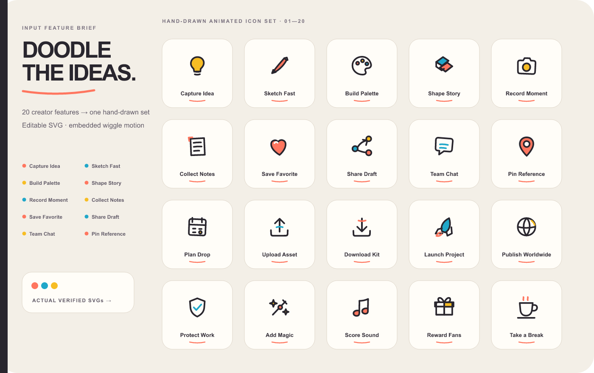

# Feature to Icons

Turn 3–20 product features into one original hand-drawn icon set. Every icon is
an editable, self-contained SVG with a subtle built-in wiggle animation and a
reduced-motion fallback.

The callable Codex Skill name is `feature-to-icons`.

<p align="center">
  
</p>

## At a glance

| Capability | Contract |
| --- | --- |
| **Best for** | Product features, creator tools, landing pages, docs, onboarding, and brand moments that need more personality than a stock icon library |
| **Input** | 3–20 unique feature names plus optional product context and palette |
| **Default look** | Original hand-drawn outline/duotone geometry on a 48 px grid, round ink strokes, restrained color accents |
| **Motion** | Self-contained `icon-wiggle` CSS animation in every SVG; `prefers-reduced-motion` disables it |
| **Static behavior** | The same SVG renders as a clean first frame when animation is unsupported |
| **Outputs** | One animated SVG per feature, playable HTML gallery, SVG/PNG contact sheets, spec, metadata, and verification manifest |
| **Optional system route** | Explicit `purpose: system` uses unmodified pinned Phosphor geometry with no motion or decoration |

## Why this route

Feature icons should feel like a set someone drew for the product. The default
route therefore uses original geometry with gently imperfect curves, a shared
stroke rhythm, a small accent palette, and one restrained motion language. It
does not decorate stock glyphs and call them branded.

```text
feature brief
  → hand-drawn metaphor and silhouette
  → one shared stroke/accent/motion system
  → safe standalone animated SVGs
  → optical checks + static and playable previews
```

The system/UI route still exists for requests that explicitly need compact,
conventional controls. It is not inferred from ordinary feature names.

## Installation

```bash
npx skills add AlbertAZ1992/creator-brand-skills \
  --skill feature-to-icons --global --agent codex
```

Start a new Codex task, or restart Codex if the Skill does not appear.

## Usage

Natural language is enough:

```text
Use $feature-to-icons for Capture Idea, Sketch Fast, Build Palette, Share Draft,
Team Chat, Launch Project, Protect Work, and Add Magic. Make it feel like a
friendly independent creator toolkit.
```

Unless you explicitly request a system family, the Skill creates hand-drawn
animated feature icons with original SVG geometry.

### Static hand-drawn icons

```text
Use $feature-to-icons for Draft, Review, Approve, Publish, and Archive.
Keep the doodle style but set motion to none.
```

### Change the palette

```text
Use $feature-to-icons for Listen, Remix, Queue, Share, and Download.
Use charcoal ink with #36C5F0 and #FFB000 accents.
```

### Explicit native system icons

```text
Use $feature-to-icons for Search, Settings, Notifications, Profile, and Help.
These are compact 24 px system controls: purpose system, regular outline.
```

This opt-in route uses one pinned `@phosphor-icons/core@2.1.1` weight. It does
not add wiggles, badges, tiles, or marketing decoration.

## Options

| Option | Values | Default |
| --- | --- | --- |
| `features` | 3–20 unique names | Required |
| `purpose` | `brand`, `system` | `brand` |
| `motion` | `wiggle`, `none` | `wiggle` for brand; `none` for system |
| `style` | `outline`, `filled`, `duotone` | `outline` |
| `colors.primary` | Hex color | `#25232B` for brand; `currentColor` for system |
| `colors.secondary` | Hex color | `#FF735C` for brand |
| `gridSize` | `24`, `32`, `48` | `48` for brand; `24` for system |
| `strokeWidth` | Positive number | `2.6` for brand; `2` for system |
| `visualWeight` | `light`, `regular`, `bold` | `regular` |
| `cornerRadius` | `rounded`, `round`, `sharp` | `round` for brand |
| `productContext` | Product description | None |

## Animation contract

An animated hand-drawn SVG contains:

- `data-icon-treatment="hand-drawn"`;
- `data-icon-motion="wiggle"`;
- internal `@keyframes icon-wiggle` rules;
- a `prefers-reduced-motion: reduce` fallback;
- no script, event handler, raster content, external URL, font, or stylesheet.

The animation transforms the grouped drawing only. It does not morph paths, so
the artwork stays editable and the static silhouette remains the source of
truth.

## Output

```text
icon-output/
├── <feature>.svg
├── icon-family-preview.html
├── icon-family-preview.svg
├── icon-family-preview.png
├── icon-spec.json
├── icon-metadata.json
└── icon-family-manifest.json
```

- Each feature SVG is the actual deliverable, not a screenshot extracted from
  the showcase.
- `icon-family-preview.html` plays every SVG together for motion review.
- The PNG and SVG contact sheets prove the static first frame.
- The manifest records exact feature coverage, treatment, motion, source
  strategy, visible bounds, optical center, ink ratio, warnings, and checks.

Delivery rejects missing features, mixed source families, unsafe markup,
wrong grids or stroke widths, invisible icons, missing animation/reduced-motion
markers, excessive center offsets, and insufficient padding.

## Example

The checked-in [Creator Doodles gallery](examples/) contains 20 actual animated
SVGs, the original feature brief, a static source-to-output board, a playable
HTML preview, and a passing manifest with no optical warnings.

## Developer API

```typescript
import {
  buildPrompt,
  deliverIconFamily,
  validate,
} from "@creator-brand-skills/feature-to-icons";

const result = validate({
  features: ["Capture Idea", "Share Draft", "Launch Project"],
  productContext: "A playful creator toolkit",
});
if (!result.data) throw new Error(JSON.stringify(result.errors));

const prompt = buildPrompt(result.data);
const rawSvgJson = await runCapableModel(prompt);
await deliverIconFamily(result.data, rawSvgJson, "/absolute/path/to/icon-output");
```

For the explicit system route, use `deliverPhosphorIconFamily()` after setting
`purpose: "system"` and `motion: "none"`.

## Verification

```bash
./scripts/verify.sh feature-to-icons

cd feature-to-icons
npm run examples
npm run verify:examples
```

The package verification covers input validation, prompt generation, SVG
safety, hand-drawn and motion markers, reduced-motion behavior, rendering,
optical balance, playable preview generation, provenance, and all committed
example artifacts.

Feature to Icons is MIT licensed. The optional library-backed system route uses
Phosphor Icons 2.1.1 under MIT; see
[THIRD_PARTY_NOTICES.md](THIRD_PARTY_NOTICES.md).

Implementation details and the manifest contract are in
[`docs/architecture.md`](docs/architecture.md) and [`schemas/`](schemas/).
