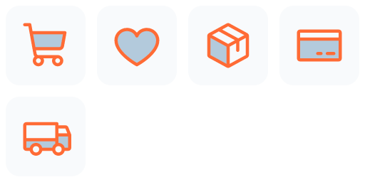

# Feature to Icons

Turn 3–20 product features into one consistent, editable, and validated SVG
icon family. This open-source Agent Skill gives Codex a pinned Phosphor icon
catalog instead of asking a model to draw unrelated SVG paths from scratch.

The callable Codex Skill name is `feature-to-icons`.

<p align="center">
  
</p>

## At a glance

| Capability | Contract |
| --- | --- |
| **Best for** | Product navigation, feature lists, settings, dashboards, and marketing pages that need one coherent icon family |
| **Input** | 3–20 unique feature names, with optional product context and explicit icon overrides |
| **Native styles** | Outline in light, regular, or bold weight; filled; duotone |
| **Presentation controls** | Primary/secondary colors and a 24, 32, or 48 px grid |
| **Output formats** | Editable SVG per feature, SVG/PNG family previews, normalized spec JSON, provenance JSON, and verification manifest JSON |
| **Core guarantee** | One pinned Phosphor version and one native weight per family; ambiguous metaphors are surfaced instead of silently guessed |

## What it does

```text
feature names → semantic search in pinned Phosphor catalog
              → one shared native weight → color/grid adaptation
              → SVG safety + optical checks → previews + provenance manifest
```

This library-first approach preserves geometry reviewed by an established icon
community. The Skill uses custom generation only when the catalog has no
credible metaphor and the user accepts that fallback.

## Visual quality bar

The family must tell one product story, not merely collect individually valid
symbols. Prefer context-specific features, distinct silhouettes, comparable
visual volume, and metaphors that remain legible without labels. The styled
hero above arranges the same six verified SVGs used in the clean deliverable
preview; it does not redraw them.

## Requirements

- Codex or another compatible Skill runtime
- Node.js 22 and npm
- A request containing 3–20 unique feature names

No image-generation model, browser request, or system SVG renderer is required.
The pinned `@phosphor-icons/core` and resvg packages work offline after install.

## Installation

Install the published Skill globally for Codex:

```bash
npx skills add AlbertAZ1992/creator-brand-skills \
  --skill feature-to-icons --global --agent codex
```

Start a new Codex task, or restart Codex if the Skill does not appear.

## Usage

A short request is enough:

```text
Use $feature-to-icons to make icons for Search, Filters, Team Sharing, and
Cloud Sync.
```

The default is a 24 px, regular, outline-style Phosphor family using
`currentColor`. The user does not need to provide icon names or SVG syntax.

### Add product context

```text
Use $feature-to-icons for Dashboard, Analytics, Reports, Users, Billing, and
API. The product is a cloud analytics platform for enterprise data teams.
```

Context helps choose among semantic candidates without changing the visual
source family.

### Make a filled family

```text
Use $feature-to-icons for Team Chat, File Sharing, Video Calls, Task Board, and
Calendar. Use filled icons, a 32 px grid, and #6366F1.
```

### Make a duotone family

```text
Use $feature-to-icons for Shopping Cart, Wishlist, Orders, Profile, and
Payment. Use duotone icons with #FF6B35 primary and #004E89 secondary.
```

### Resolve an ambiguous feature

If the catalog match is uncertain, the Skill returns candidates instead of
silently choosing an unrelated symbol. The user can answer naturally:

```text
Use the binoculars icon for Discovery and keep the rest of the family regular.
```

For Chinese or another non-Latin language, the Skill keeps the original feature
labels, translates each concept for catalog search, and records the selected
Phosphor icon as an explicit override. Unsupported terms fail with candidates
instead of silently receiving an unrelated alphabetical icon.

## Native style mapping

| Request | Phosphor source weight | Geometry behavior |
| --- | --- | --- |
| Outline + light | `light` | Native Phosphor light geometry |
| Outline + regular | `regular` | Native Phosphor regular geometry |
| Outline + bold | `bold` | Native Phosphor bold geometry |
| Filled | `fill` | Native Phosphor fill geometry |
| Duotone | `duotone` | Native foreground/background geometry |

One output family never mixes source libraries or weights. Colors and the
export viewBox may change; source paths are not stretched, centered, or redrawn
individually.

## Curated example gallery

All examples use pinned Phosphor 2.1.1 geometry and the same delivery path as
the Skill. The README keeps only three visually distinct families up front;
the [example index](examples/README.md) contains all nine requests, exact
overrides, source metadata, and manifests.

| **Creative workflow · duotone** |
| :---: |
|  |
| Capture Ideas, Shape Story, Build Palette, Brand Library, Publish Kit, Measure Reach |

| **Commerce · duotone** | **Collaboration · filled** |
| :---: | :---: |
|  |  |
| Shopping Cart, Wishlist, Orders, Payment, Delivery | Team Chat, File Sharing, Video Calls, Task Board, Calendar |

## Options

| Option | Values | Default | Library-first behavior |
| --- | --- | --- | --- |
| `features` | 3–20 unique names | Required | One SVG per feature |
| `style` | `outline`, `filled`, `duotone` | `outline` | Selects a native Phosphor family |
| `colors.primary` | Hex color | `currentColor` | Main presentation color |
| `colors.secondary` | Hex color | Primary at low opacity | Duotone subordinate color |
| `gridSize` | `24`, `32`, `48` | `24` | Output viewBox; source geometry scales uniformly |
| `strokeWidth` | Positive number | `2` | Helps map outline requests to light/regular/bold |
| `visualWeight` | `light`, `regular`, `bold` | `regular` | Selects the native outline weight |
| `cornerRadius` | `rounded`, `round`, `sharp` | `rounded` | Native geometry is preserved; `sharp` requires custom fallback |
| `productContext` | Product description | None | Improves semantic selection |

In library-first mode, stroke width and corner radius do not mutate individual
paths. Exact bespoke geometry belongs to the custom fallback.

## Output

```text
icon-output/
├── <feature>.svg
├── icon-spec.json
├── icon-metadata.json
├── icon-family-preview.svg
├── icon-family-preview.png
└── icon-family-manifest.json
```

- `icon-metadata.json` records the source icon, package version, weight,
  license, and whether geometry or presentation changed.
- The manifest records one source family for the set plus per-icon bounds,
  alpha-weighted center offset, ink ratio, optical volume, and warnings.
- Delivery rejects unsafe SVG, incorrect feature coverage, incompatible
  provenance, invisible icons, excessive center offset, undersized shapes, and
  insufficient padding.

## Developer API

```typescript
import {
  deliverPhosphorIconFamily,
  searchPhosphorIcons,
  validate,
} from "@creator-brand-skills/feature-to-icons";

const result = validate({ features: ["Search", "Team Sharing", "Cloud Sync"] });
if (!result.data) throw new Error(JSON.stringify(result.errors));

await deliverPhosphorIconFamily(result.data, "/absolute/path/to/icon-output");

// For an ambiguous feature:
const candidates = searchPhosphorIcons("Discovery");
```

`deliverIconFamily()` remains available for explicitly approved custom SVG
fallbacks and applies the same safety, raster, and optical delivery gates.

## How to test

```bash
./scripts/verify.sh feature-to-icons
```

The verification runs lint, formatting, type checking, build, unit tests,
prompt/input evals, a real deliverable test, and all 44 committed example SVGs.
It also verifies package provenance and optical metrics.

Regenerate the gallery from pinned library assets:

```bash
cd feature-to-icons
npm run examples
npm run verify:examples
```

## Limitations

- The Skill requires at least three features; it is not a single-icon exporter.
- Semantic retrieval can be ambiguous for private product vocabulary; those
  cases require a candidate choice or explicit override.
- Exact sharp corners or novel branded metaphors require the custom fallback.
- It produces static SVGs and does not install them into an application.

Feature to Icons is MIT licensed. Library-backed artifacts use Phosphor Icons
2.1.1 under MIT; see [THIRD_PARTY_NOTICES.md](THIRD_PARTY_NOTICES.md).

Implementation details and the manifest contract are in
[`docs/architecture.md`](docs/architecture.md) and [`schemas/`](schemas/).
