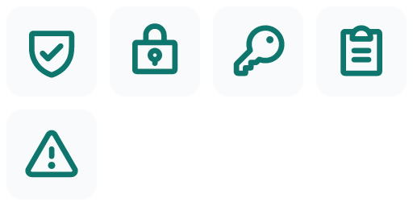

# Feature to Icons Examples

Seven generated families show the Skill across style, scale, weight, and color
combinations. Every path comes from pinned Phosphor 2.1.1 geometry; the delivery
pipeline applies presentation, provenance, raster, and optical checks.

| Family | Design system | Features |
| --- | --- | --- |
| [Product essentials](product-essentials-outline/) | Phosphor regular · 24 px | Search, Filters, Team Sharing, Cloud Sync |
| [Analytics](analytics-light-outline/) | Phosphor light · 24 px | Dashboard, Analytics, Reports, Trends, Export Data |
| [Collaboration](collaboration-filled/) | Phosphor fill · 32 px | Team Chat, File Sharing, Video Calls, Task Board, Calendar |
| [Commerce](commerce-duotone/) | Phosphor duotone · 24 px | Shopping Cart, Wishlist, Orders, Payment, Delivery |
| [Security](security-bold-outline/) | Phosphor bold · 32 px | Authentication, Encryption, Access Control, Audit Log, Alerts |
| [Creator Brand](creator-brand-duotone/) | Phosphor duotone · 32 px | Image Generation, Background Removal, Brand Kit, Export Assets, Templates |
| [AI workspace](ai-workspace-outline-48/) | Phosphor regular · 48 px | AI Copilot, Knowledge Search, Automation, Version History |

## Preview every family

### Product essentials · outline · regular


### Analytics · outline · light


### Collaboration · filled


### Commerce · duotone


### Security · outline · bold



### Creator Brand · duotone · 32 px


### AI workspace · outline · 48 px


## What is in each directory

```text
family-name/
├── example.json                 # request, input, and exact source overrides
├── feature-name.svg             # one editable asset per requested feature
├── icon-spec.json               # normalized design system and source policy
├── icon-metadata.json           # metaphor, source, version, weight, and license
├── icon-family-preview.svg      # editable family sheet
├── icon-family-preview.png      # rendered proof
└── icon-family-manifest.json    # exact files and passed delivery checks
```

Open `example.json` to see the natural-language request, normalized input, and
source icon mapping. The manifest records library provenance and one set of
optical metrics per requested feature.

## Regenerate and verify

From the `feature-to-icons` directory:

```bash
npm install
npm run examples
npm run verify:examples
```

`npm run examples` replaces only the seven named example-family directories.
`npm run verify:examples` checks the exact directory set, request validity,
manifest coverage, pinned Phosphor provenance, SVG safety rules, PNG signature,
preview dimensions, optical metric coverage, and zero unresolved optical
warnings.
