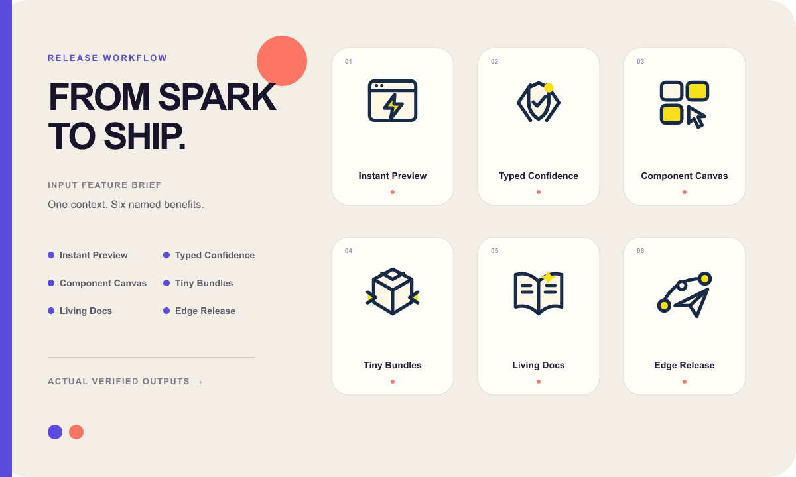
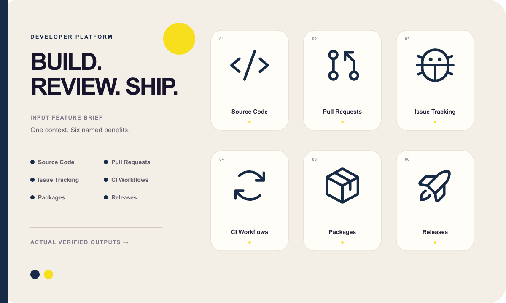

# Feature to Icons examples

The public gallery contains exactly three current families. Every showcase
places the input feature brief on the left and the actual verified SVG outputs
on the right.

## Creator Studio · original brand geometry

<p align="center">
  
</p>

## Release Workflow · original brand geometry

<p align="center">
  
</p>

## Developer Platform · native system geometry

<p align="center">
  
</p>

| Family | Route | Deliverables |
| --- | --- | --- |
| [`creator-studio-duotone/`](creator-studio-duotone/) | Original custom duotone · 48 px | 6 SVGs, input request, previews, spec, metadata, manifest |
| [`release-workflow-duotone/`](release-workflow-duotone/) | Original custom duotone · 48 px | 6 SVGs, input request, previews, spec, metadata, manifest |
| [`developer-platform-outline/`](developer-platform-outline/) | Phosphor regular · 32 px | 6 SVGs, explicit semantic overrides, previews, provenance, manifest |

The branded families use distinct custom silhouettes. The system family keeps
the pinned `@phosphor-icons/core@2.1.1` geometry undecorated. All three pass
SVG safety, exact feature coverage, visible-pixel, optical-volume, center, and
provenance checks with no warnings.

```bash
npm run examples
npm run verify:examples
```

Regeneration first removes every retired example directory, then rebuilds
exactly these three families and 18 SVG icons.
