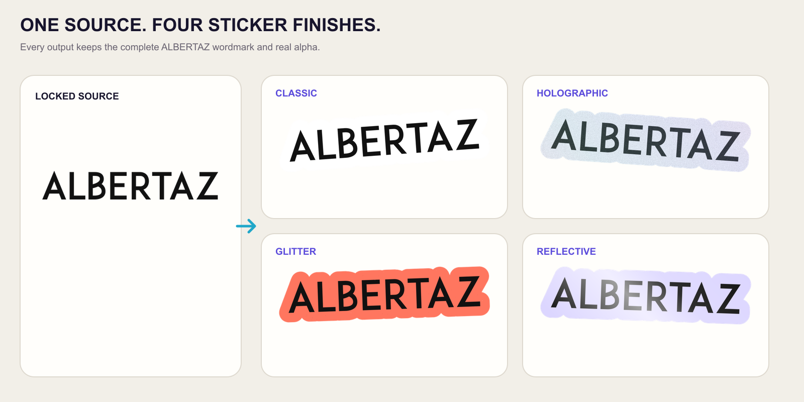

# Image to Sticker

Turn a simple logo, wordmark, icon, badge, or flat illustration into one
production-ready transparent PNG sticker. This open-source Agent Skill keeps
the supplied artwork intact, removes a transparent or flat background, adds a
contour, and can apply a deterministic front finish in Codex.

The callable Codex Skill name is `image-to-sticker`.

<p align="center">
  
</p>

The featured board keeps one locked ALBERTAZ source beside four actual
`sticker.png` deliveries: classic, holographic, glitter, and reflective. Each
1024 px RGBA output has its own alpha proof, reproducible source card, source
hash, and passing manifest under `examples/generated/albertaz-brand/`.

Vite, React, TypeScript, Astro, Vue, and Deno remain in the secondary gallery
to exercise colour-contour and borderless controls as well as different source
geometries. Their names and marks belong to their respective owners and are
used only as attributed transformation fixtures.

## At a glance

| Capability | Contract |
| --- | --- |
| **Best for** | One already-composed logo, wordmark, icon, badge, or flat illustration |
| **Supported sources** | SVG or raster artwork with existing transparency or one uniform removable background color |
| **Styles** | Borderless or contoured; original, holographic, glitter, or reflective front finish |
| **Controls** | 0–44 contour width, custom contour color, −12° to 12° whole-sticker tilt, 512 or 1024 px output |
| **Output formats** | Transparent RGBA PNG, grayscale alpha-proof PNG, reproducible source-card JSON, and verification manifest JSON |
| **Core guarantee** | The renderer preserves the complete source composition, rasterizes small-viewBox SVGs at delivery density, and applies every finish without changing alpha geometry |

## What it does

- Preserves the source composition instead of redrawing it.
- Probes SVG dimensions and rasterizes tiny intrinsic viewBoxes near the
  working delivery resolution instead of enlarging a blurry decode.
- Accepts transparent artwork or artwork on one uniform background color.
- Builds a true transparent PNG with an adjustable contour.
- Supports original, holographic, glitter, and reflective front materials.
- Applies optional whole-sticker tilt without changing internal layout.
- Returns the sticker, an alpha proof, a reproducible source card, and a
  machine-verifiable manifest.

It is intentionally for simple, already-composed artwork. It does not choose a
subject from a busy photograph, reconstruct missing pixels, retype a wordmark,
or generate a 3D peel scene.

## Visual quality bar

The output asset and presentation preview are separate files. `sticker.png`
stays transparent and contains only the complete supplied composition, contour,
material, and tilt. A README or portfolio card may add contrast, shadow, or
decorative colour around that accepted asset, but those effects are never baked
into the deliverable.

Review at full size and 64 px. SVG diagonals and curves must remain as crisp as
the same source viewed in a browser. Use the thinnest contour that keeps the artwork
readable without swallowing counters or small gaps. Material effects should
remain subordinate to the illustration instead of turning it muddy.

## Requirements

- Codex or another agent that supports local skills
- Node.js 22.13 or newer for direct renderer use
- ImageMagick and `jq` only when regenerating visual examples or running the
  shell deliverable evaluation

## Installation

Install the published Skill globally for Codex:

```bash
npx skills add AlbertAZ1992/creator-brand-skills \
  --skill image-to-sticker --global --agent codex
```

Restart Codex after installation so the skill is discovered. To work on the
renderer directly:

```bash
cd image-to-sticker
npm install
npm run build
```

## Usage in Codex

Attach an image and ask naturally. A short request is enough:

> Turn this into a sticker.

The skill chooses safe defaults when details are omitted. Add only the controls
you care about:

> Use Image to Sticker on this transparent logo. Keep the original colors, add
> a thin white outline, and do not rotate it.

> Make this flat-background badge a holographic sticker with a pink outline and
> a slight clockwise tilt.

> Create a borderless transparent sticker from this icon.

For ambiguous photos, crop or isolate the intended subject first. This skill
will not silently guess which object to keep.

## Controls

| Control | Values | Default | Meaning |
| --- | --- | --- | --- |
| `backgroundMode` | `alpha`, `flat` | inferred | Keep existing alpha or remove one flat background |
| `outlineWidth` | `0`–`44` | `18` | Contour control; `0` is borderless |
| `outlineColor` | CSS hex | `#ffffff` | Contour color |
| `material` | `original`, `holographic`, `glitter`, `reflective` | `original` | Deterministic front finish |
| `tilt` | `-12`–`12` | `-3` | Whole-sticker rotation in degrees |
| `size` | `512`, `1024` | `1024` | Square PNG output size |

The Euclidean outline expansion is `outlineWidth × 2.35`, matching Sticker
Forge. Flat-background removal also handles enclosed background regions and
unmattes antialiased edges, which avoids a pale fringe around the result.

## Direct renderer usage

Create a source card describing the operation:

```json
{
  "version": 4,
  "sourceImage": "logo.png",
  "backgroundMode": "alpha",
  "outlineWidth": 6,
  "outlineColor": "#ffffff",
  "material": "original",
  "tilt": 0,
  "size": 1024
}
```

Then run:

```bash
bash scripts/render-sticker.sh logo.png source-card.json output
```

The source card must name the image actually supplied. This prevents a result
from carrying misleading provenance.

## Output

Every successful render writes:

```text
output/
├── sticker.png               transparent RGBA artwork
├── sticker-alpha-proof.png   grayscale transparency proof
├── source-card.json          normalized reproducible controls
└── sticker-manifest.json     dimensions, pipeline values, and checks
```

The manifest passes only when the PNG is RGBA, corners are transparent,
coverage is plausible, and visible alpha exists. Material effects may alter
visible RGB, but never the alpha geometry.

## Examples and verification

See [`examples/README.md`](examples/README.md) for the six source-to-output
styles and every clean delivery file.

```bash
npm run examples
npm run verify
```

`npm run verify` runs formatting, lint, type checking, build, unit tests,
behavior evals, and a real raster deliverable evaluation. The architecture and
format contracts are documented in [`docs/architecture.md`](docs/architecture.md)
and [`schemas/`](schemas/).

## Limitations

- Busy photographic backgrounds require a dedicated subject-isolation step.
- Very small raster inputs cannot gain real detail by exporting at 1024 px;
  resolution-independent SVG inputs are rasterized at adaptive density.
- A wide contour can intentionally close small holes; use a thinner contour
  when counters and gaps matter.
- SVG text depends on fonts available to the rasterizer. Convert important type
  to outlines before rendering.

Third-party lineage and licenses are recorded in
[`THIRD_PARTY_NOTICES.md`](THIRD_PARTY_NOTICES.md).
