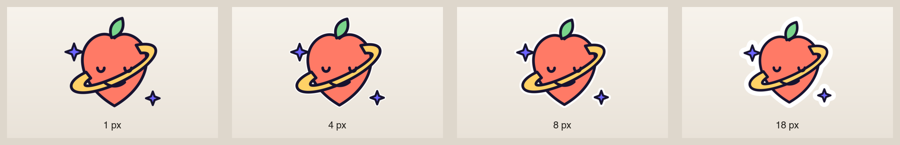
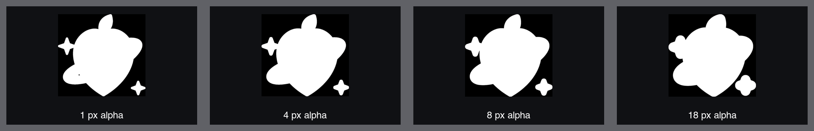
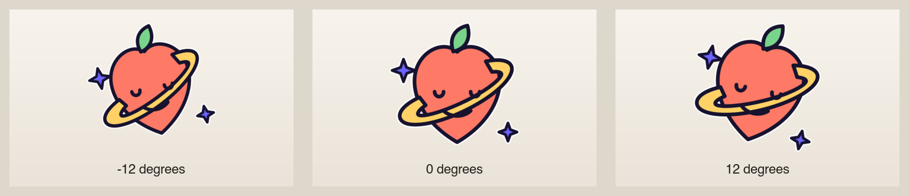
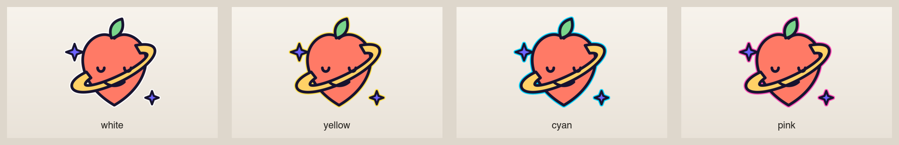
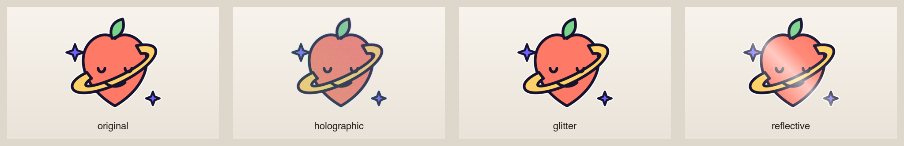

# Image to Sticker visual examples

The main showcase uses the original Peach Planet illustration. It is colourful,
contains fine gaps, separate sparkles, and an orbit crossing the central shape,
so it exposes contour and material problems more clearly than a plain wordmark.

  

The preview above is presentation only. The actual transparent PNG, alpha
proof, source card, and passing manifest are in
[`generated/recommended/`](generated/recommended/).

## Style system

The complete grid holds source geometry constant while comparing borderless,
thin, classic, and colour contours plus original, holographic, glitter, and
reflective front materials.

  

| Control | Visual proof |
| --- | --- |
| Outline width and topology |  |
| Alpha expansion |  |
| Whole-sticker tilt |  |
| Contour colour |  |
| Front material |  |

## Source boundary

Transparent artwork and one removable flat background are both supported. The
two contract fixtures and their complete deliverables live under
[`generated/source-types/`](generated/source-types/).

  

Regenerate everything with `npm run examples`. The script uses the actual
renderer for every result; it does not redraw the illustration for the README.
