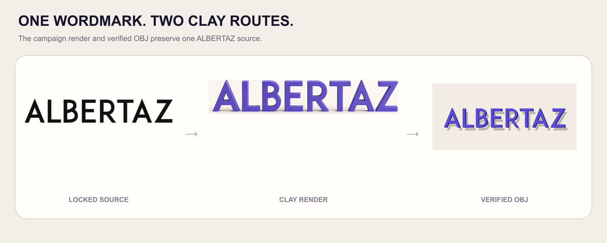
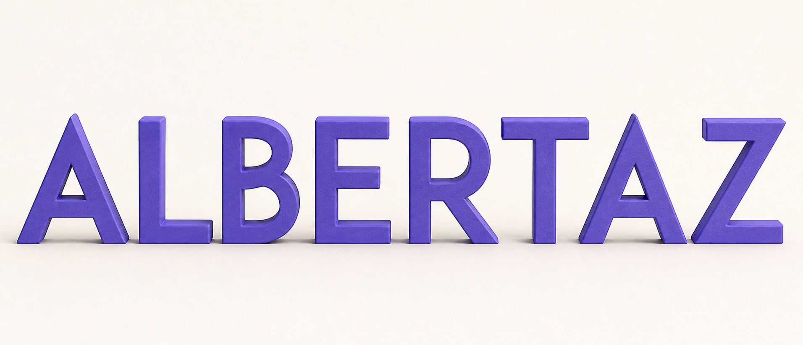

# Logo to Clay

Turn a flat SVG or PNG logo into a refined clay logo render, a verified OBJ 3D
mesh, or both. This open-source Agent Skill gives Codex a fast image route and
a deterministic geometry route for production-ready brand assets.

The callable Codex Skill name is `logo-to-clay`.

<p align="center">
  
</p>

The board shows both delivery routes against the same locked source: an
expressive campaign render and a procedural OBJ/MTL mesh with a verified
preview. The ALBERTAZ object contains 15,402 vertices, 5,134 faces, and three
preserved through-cavities. Vite and JavaScript runs remain below as independent
shape and relief tests.

| **ALBERTAZ · image route** | **ALBERTAZ · verified mesh route** |
| :---: | :---: |
| Complete wordmark, visible sidewalls, campaign-ready composition | 15,402 vertices, 5,134 faces, three cavities, OBJ, MTL, bump map, preview, and passing manifest |

## At a glance

| Capability | Contract |
| --- | --- |
| **Best for** | Turning one simple logo or icon into a clay campaign visual, a usable 3D asset, or both |
| **Supported sources** | SVG or PNG with transparency or a clearly contrasting flat background |
| **Production routes** | `image`, `mesh`, or `both` |
| **3D forms** | Standalone `object` or backed `relief`; both use the same refined matte clay material |
| **Controls** | Extrusion depth, clay color, and studio or transparent render background |
| **Output formats** | Generated raster + final prompt; OBJ, MTL, bump PNG, 1024 px preview PNG, and verification manifest JSON |
| **Core guarantee** | Image mode locks source contour and negative space before styling; mesh mode preserves enclosed holes and validates real geometry and material linkage |

## What it does

Logo to Clay has two independent production routes:

```text
Clay Render: logo reference → clay image prompt → image model → raster image
Clay Asset:  logo geometry → contour extraction → extrusion → OBJ/MTL
             → 1024 px preview → manifest verification
```

Use the render route for a fast visual. Use the mesh route when the user needs
real geometry for Blender, Three.js, Unity, or another 3D workflow.

## Visual quality bar

A good render preserves the exact outer contour, relative proportions,
counters, openings, component spacing, baseline, overlap, and reading order
before it adds style. The default campaign composition places the mark at
55–75% of the frame, uses 20–30° of camera yaw and 8–14° of elevation, keeps a
12–20% sidewall visible, and grounds it with one low plinth and decisive contact
shadow. Neutral catalogue framing is allowed only when requested; the default
must not be a generic object floating on beige.

The image route and mesh route prove different things. The ALBERTAZ hero above
shows art direction beside independently verified standalone geometry. The Vite
run tests a multi-colour symbol, while JavaScript tests both standalone and
relief geometry. A beautiful raster is never presented as evidence that
geometry was exported successfully.

| **ALBERTAZ wordmark** | **Vite bolt** | **JavaScript** |
| :---: | :---: | :---: |
|  |  |  |
| Campaign render + standalone object | Campaign render + standalone object | Campaign render + standalone object + relief |

## Deliverables (not clay styles)

These choices only control which files are returned. They do not select a
different clay material or mesh style.

- **Image:** generate a refined clay-style raster using the logo as a visual
  reference. No OBJ is produced.
- **Mesh:** procedurally extract the logo contour and create a verified OBJ,
  MTL, preview, and manifest. No image model is required.
- **Both — default:** generate the image prompt and create the verified mesh
  package.

Natural language selects the mode. “Make a clay image” routes to `image`;
“export an OBJ” routes to `mesh`; “give me the render and model” routes to
`both`.

## Requirements

- Codex or another compatible Skill runtime
- Node.js 22 and npm
- A simple SVG or PNG logo with transparency or a contrasting flat background
- A reference-image-capable image generator for `image` and `both` render output

Mesh mode runs locally and does not require an image-generation API.

## Installation

Install the published Skill globally for Codex:

```bash
npx skills add AlbertAZ1992/creator-brand-skills \
  --skill logo-to-clay --global --agent codex
```

Start a new Codex task, or restart Codex if the Skill does not appear.

## Usage

Attach a logo to Codex or provide its path. A minimal request is enough:

```text
Use $logo-to-clay to turn this logo into clay.
```

With no output mode specified, the Skill uses `both`, `object`, `4 mm`,
auto-detected color, and `studio` defaults.

### Generate only a clay image

```text
Use $logo-to-clay to make a clay render of this logo on a warm studio
background. I only need the image.
```

### Export only a real 3D model

```text
Use $logo-to-clay on this SVG. Export a clay object OBJ mesh with a 4 mm depth.
Save the OBJ, MTL, preview, and manifest in my output folder.
```

### Generate both formats

```text
Use $logo-to-clay on this logo. Return the clay render and the verified OBJ
asset package.
```

### Make a flat relief

```text
Use $logo-to-clay on this logo as a 2 mm clay relief with a transparent render
background.
```

## 3D forms — exactly two

| Choice | Visual result | Good for |
| --- | --- | --- |
| `object` | A standalone, softly beveled clay logo | Default brand marks and app symbols |
| `relief` | A shallow raised logo on a backing surface | Plaques and subtle embossing |

The public 3D form API contains only `object` and `relief`. The former
`badge` and `freestanding` forms and the `subtle` and `handmade` texture
presets have been removed; they are not aliases or hidden modes. Runtime
validation rejects those former values instead of silently accepting them.

Both forms use the same refined matte clay material with restrained
micro-variation. It has no fingerprint or tool-mark preset. `relief` is the
only structural variant: it adds real backing geometry behind the logo.

## Options

| Option | Values | Default | Meaning |
| --- | --- | --- | --- |
| `logoPath` | SVG or PNG path | Required | Source logo |
| `outputDir` | Directory path | `outputs/` | Mesh package destination |
| `output` | `image`, `mesh`, `both` | `both` | Requested production route |
| `shape` | `object`, `relief` | `object` | 3D form |
| `depth` | Non-negative millimeters | `4` | Extrusion depth |
| `clayColor` | Six-digit hex color | Logo primary color | Clay material color |
| `background` | `transparent`, `studio` | `studio` | Image-render background |

Users can describe these choices naturally. They do not need to mention option
names or write JSON.

## Output

### Image mode

Returns the generated raster image and the final clay-render prompt used for
generation.

### Mesh mode

```text
clay-output/
├── logo-clay-mesh.obj
├── logo-clay-clay.mtl
├── logo-clay-bump.png
├── logo-clay-preview.png
└── logo-clay-manifest.json
```

- The OBJ contains real vertices and faces extracted from the source contour.
- The MTL is referenced by the OBJ and links the matte clay bump texture.
- The preview is 1024 × 1024, with a deterministic fallback when headless
  WebGL is unavailable.
- The manifest records the source, options, output paths, geometry counts, and
  validation result.

Both mode returns the image route plus the complete mesh package.

## How to test

Test each production route and the only two real geometry forms:

| Test | Request | Expected behavior |
| --- | --- | --- |
| Default | “Turn this logo into clay.” | Both render route and verified mesh package |
| Image | “Make a clay image only.” | Generated raster and prompt; no OBJ requirement |
| Mesh | “Export a clay object OBJ only.” | OBJ, MTL, bump map, 1024 px preview, passing manifest |
| Object | “Make a standalone clay object.” | Slim, softly beveled logo without backing geometry |
| Relief | “Make a 2 mm relief.” | Raised logo plus backing geometry |
| Transparent | “Make the render background transparent.” | Image prompt requests an isolated alpha background |

For mesh results, inspect the preview and confirm the OBJ opens in a 3D tool.
Full copy-ready tests are in
[`../examples/logo-to-clay.md`](../examples/logo-to-clay.md).

Repository contributors can run the automated package verification from the
repository root:

```bash
./scripts/verify.sh logo-to-clay
```

It runs static checks, unit tests, request-option evals, and a real
OBJ/MTL/PNG/manifest delivery eval.

## Limitations

- SVG is rasterized at 1024 px before contour tracing; PNG is traced at 512 px.
  Both routes intentionally approximate the visible silhouette rather than
  claiming exact source-vector geometry.
- Complex gradients, photographic detail, and very thin logo features cannot
  be represented faithfully in an extruded mesh.
- Image quality depends on the available image model.
- The mesh route exports OBJ/MTL, not GLB or USDZ.
- A passing manifest proves file and geometry integrity, not subjective visual
  quality; inspect the preview before use.
- The Skill creates local assets but does not publish or install them.

Implementation details and the manifest contract are in
[`docs/architecture.md`](docs/architecture.md) and [`schemas/`](schemas/).
The checked-in visual outputs and their full mesh packages are in
[`examples/README.md`](examples/README.md).
