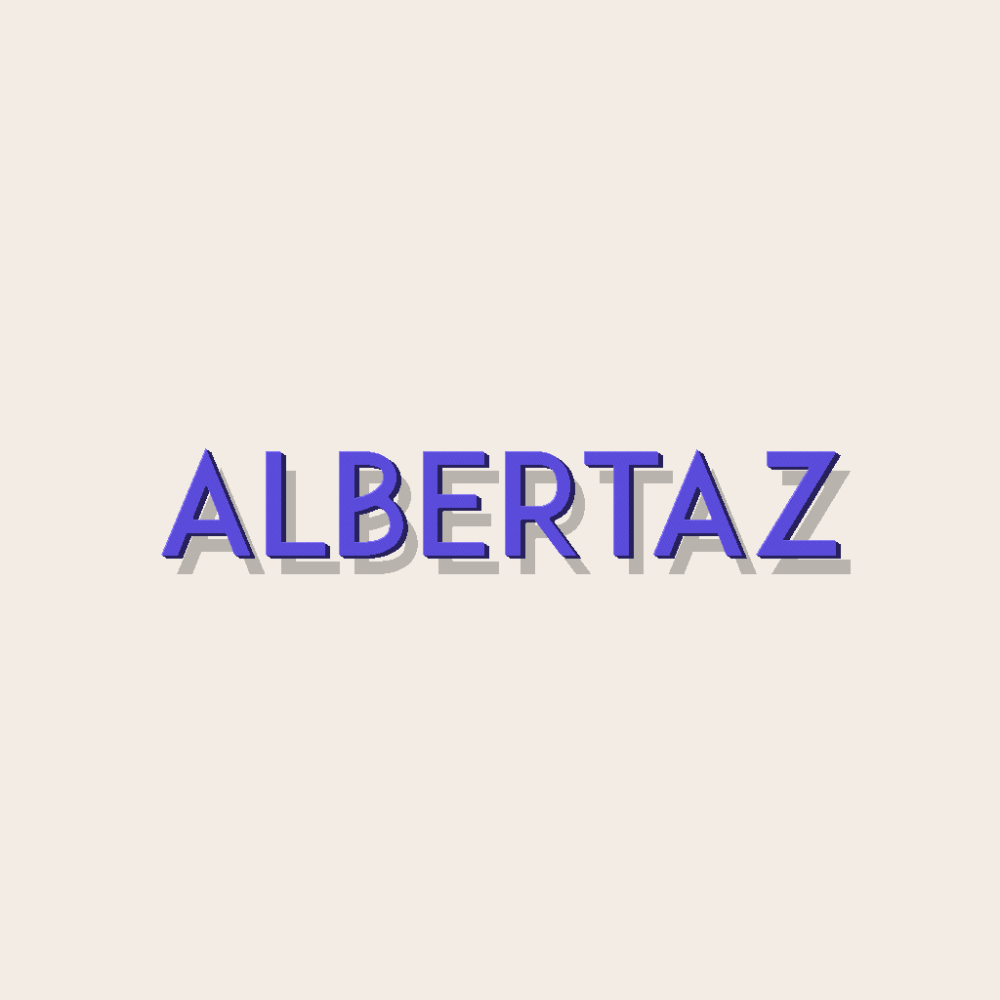

# Logo to Clay examples

<p align="center">
  
</p>

Every row makes the input/output boundary explicit: the source logo stays
visible beside the expressive clay render and the independently generated mesh
preview.

## Featured: ALBERTAZ wordmark

<p align="center">
  
</p>

| **Source** | **Verified mesh preview** |
| :---: | :---: |
|  |  |
| Locked wordmark input | 4 mm standalone object; 15,402 vertices, 5,134 faces, three cavities |

[`generated/albertaz-wordmark/`](generated/albertaz-wordmark/) contains the
campaign render, source SVG/PNG, OBJ, linked MTL, bump map, 1024 px preview,
and passing manifest.

## Additional approved runs

| **Vite bolt** | **JavaScript** |
| :---: | :---: |
|  |  |
| Multi-colour campaign render + standalone object | Campaign render + standalone object + 2 mm relief |

[`generated/vite-bolt/`](generated/vite-bolt/) and
[`generated/javascript/`](generated/javascript/) contain their source files,
campaign renders, verified mesh packages, and passing manifests. The render
and geometry routes remain intentionally independent.

## Regenerate the approved examples

The three accepted campaign renders are checked visual references. The command
below re-copies their pinned sources and rebuilds all deterministic mesh
packages: ALBERTAZ object, Vite object, JavaScript object, and JavaScript relief.

```bash
npm run examples
```

Canonical inputs live in [`sources/`](sources/). The command does not create a
new unreviewed beauty render or restore a retired fixture.
