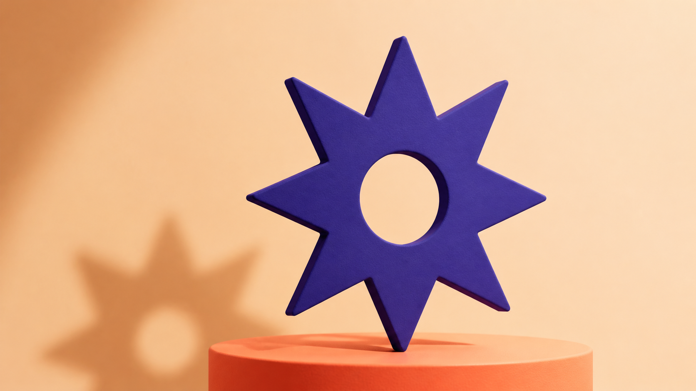
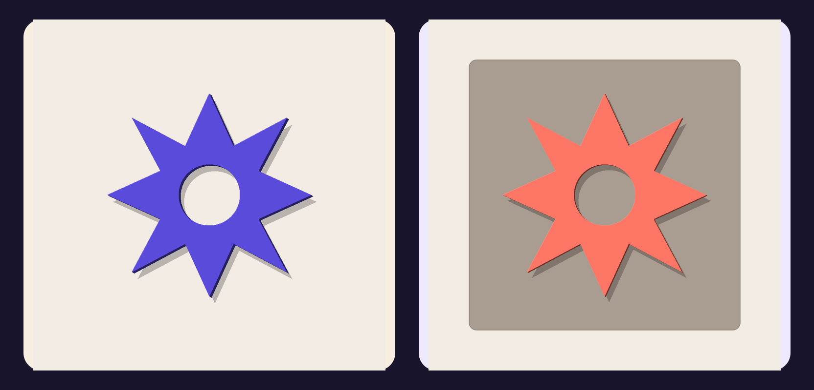

# Logo to Clay examples

The gallery uses the original Orbit Bloom mark across both production routes.
The generated campaign image demonstrates art direction; the mesh previews and
files come from the real local OBJ pipeline.

| **Generated image route** | **Verified mesh route** |
| :---: | :---: |
|  |  |
| Cobalt matte clay, coral plinth, apricot studio light | Violet 5 mm object and coral 2 mm relief |

## What is real in each view

- `generated/clay-render.png` was made from
  [`assets/orbit-bloom.png`](assets/orbit-bloom.png) with a
  reference-image-capable generator. It proves the image route and remains a
  subjective visual result.
- `generated/object/` and `generated/relief/` each contain an OBJ, linked MTL,
  bump map, 1024 px preview, and passing manifest created by the deterministic
  mesh route.
- The central counter remains open in both procedural meshes.

Regenerate the source preview and both mesh packages from this directory:

```bash
npm run examples
```

The original SVG source is also checked in at
[`assets/orbit-bloom.svg`](assets/orbit-bloom.svg).
