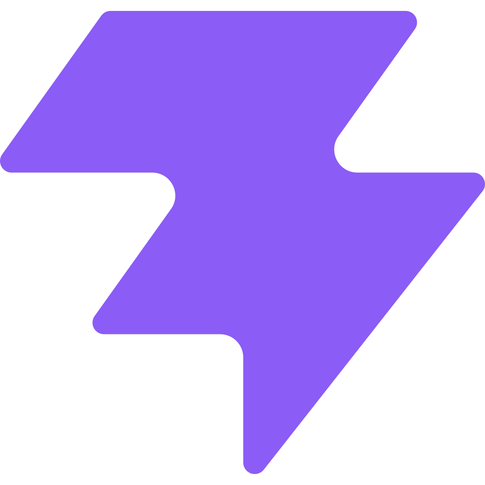
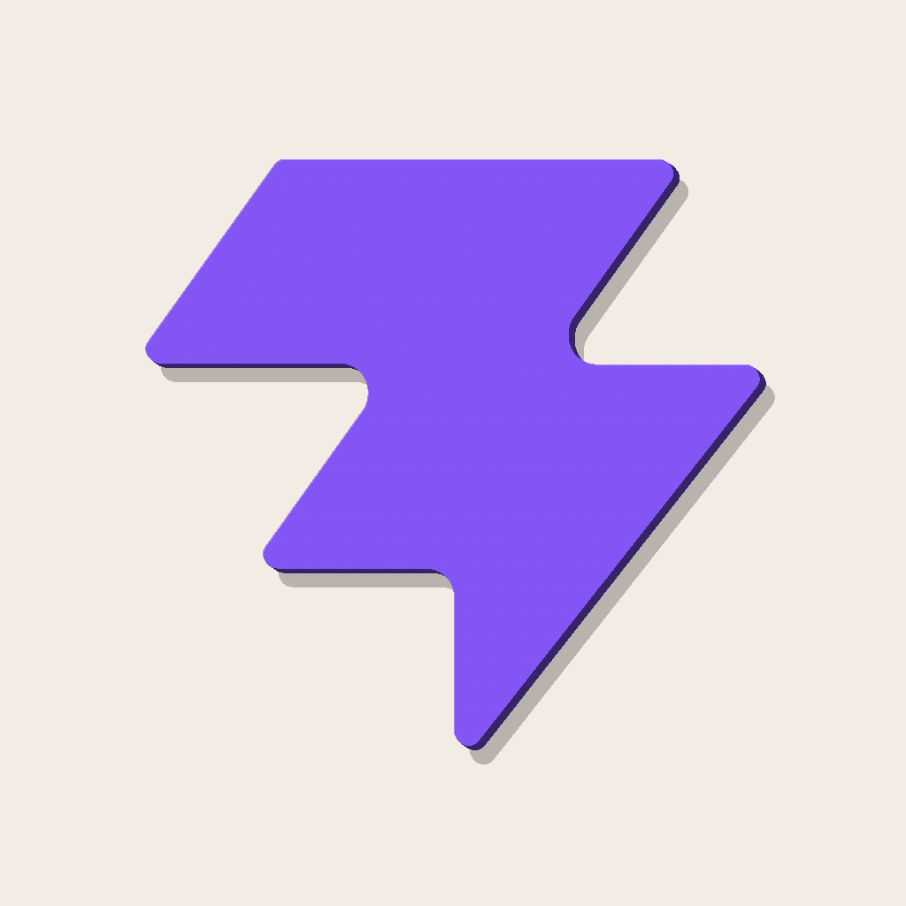

# Logo to Clay examples

## Featured: Vite bolt clay

<p align="center">
  
</p>

| **Source** | **Verified mesh preview** |
| :---: | :---: |
|  |  |
| Gradient bolt input | 6 mm standalone object; 5,388 vertices, 1,796 faces |

[`generated/vite-bolt/`](generated/vite-bolt/) contains the campaign render,
source SVG/PNG, OBJ, linked MTL, bump map, 1024 px preview, and passing manifest.

## Second approved run: JavaScript clay

<p align="center">
  
</p>

| **Source** | **Verified mesh preview** |
| :---: | :---: |
|  |  |
| Flat yellow-and-black input | 5 mm standalone object; OBJ, MTL, bump map, preview, and manifest |

[`generated/javascript/`](generated/javascript/) contains its campaign render,
source image, 5 mm standalone object, 2 mm relief, both OBJ/MTL packages, and
passing manifests. The render and geometry routes are intentionally independent.

## Regenerate the approved examples

The two accepted campaign renders are checked visual references. The command
below re-copies their pinned sources and rebuilds all three deterministic mesh
packages: Vite object, JavaScript object, and JavaScript relief.

```bash
npm run examples
```

Canonical inputs live in [`sources/`](sources/). The command does not create a
new unreviewed beauty render or restore a retired fixture.
