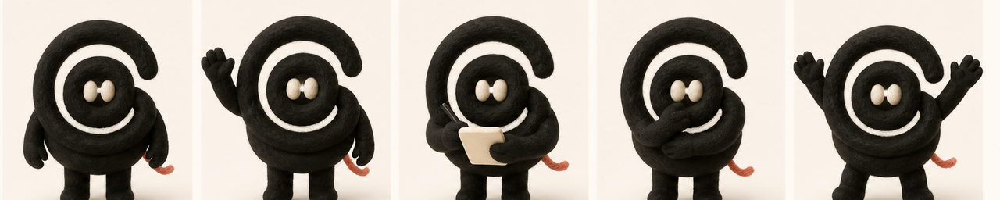

# Product to Mascot

Turn product semantics into a reusable brand character. The skill first locks a
character bible, then generates and reviews a primary reference plus four
consistent poses.

<p align="center">
  
</p>

## The contract

```text
Product facts → character bible → primary reference → four pose references
              → contact-sheet review → verified mascot reference set
```

The primary reference and every pose must retain the same silhouette, face rule,
palette, signature feature, and illustration medium.

## Supported directions

| Control | Supported choices |
| --- | --- |
| Mascot type | `animal`, `character`, `abstract`, or `robot` |
| Personality | `friendly`, `professional`, `playful`, `technical`, or `approachable` |
| Visual medium | One user-supplied or proposed medium, such as flat vector, felt, clay, or ink; the accepted medium is locked across the set |
| Palette | Three to five exact colors recorded in the character bible |
| Reference poses | Primary, welcome, focused work, thinking/help, and celebration |

Product name and factual description are required. Audience, personality,
mascot type, visual style, and existing brand assets are optional. When a
direction is omitted, the Skill proposes it from product semantics and records
the accepted choice before generating the pose set.

## Install

Install the published Skill globally for Codex:

```bash
npx skills add AlbertAZ1992/creator-brand-skills \
  --skill product-to-mascot --global --agent codex
```

## Use it

```text
Use $product-to-mascot for Threads, a text-first social product built around
public conversation. Create a friendly loop-shaped mascot in soft felt with a
small coral thread tail. Generate the verified reference set.
```

Expected result: a `character-bible.json`, primary reference image, four named
poses, a contact sheet, and a manifest. A pose is retried only when it breaks a
locked identity rule; it is not regenerated merely to make a different-looking
variant.

## Deliverables

- `character-bible.json`
- `mascot-primary.png`
- `mascot-welcome.png`, `mascot-working.png`, `mascot-thinking.png`, and
  `mascot-celebrate.png`
- `mascot-contact-sheet.png`
- `mascot-manifest.json`

The contact-sheet helper needs ImageMagick:

```bash
brew install imagemagick
scripts/verify-mascot-reference-set.sh mascot-reference-set
```

## Verify

From the repository root:

```bash
./scripts/verify.sh product-to-mascot
```

`verify` runs lint, formatting, types, units, offline evals, and the real
deliverable check. `verify:deliverables` creates disposable reference fixtures
and proves the validator rejects missing or undersized inputs before producing
the contact sheet. The input, character-bible, and manifest contracts are in
[`schemas/`](schemas/).

## Scope

Use this skill when a product needs a consistent long-lived character. Use a
general image-generation request for an isolated character illustration.

The README contact sheet is an unofficial transformation example inspired by
the Threads product identity. Threads is a trademark of Meta Platforms, Inc.;
this project is not affiliated with or endorsed by Meta. See
[`THIRD_PARTY_NOTICES.md`](THIRD_PARTY_NOTICES.md).
