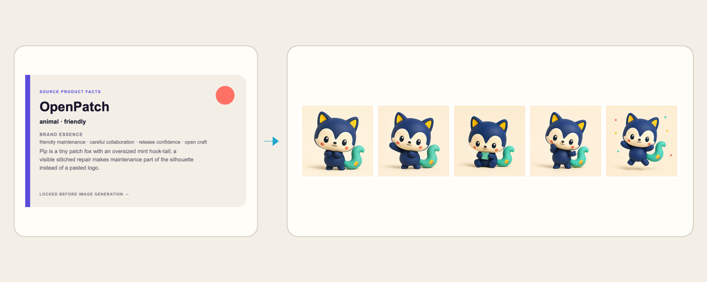

# Product to Mascot

Turn product semantics into a reusable product mascot and brand character
system. This open-source Agent Skill first locks a character bible, then helps
Codex generate and review a primary reference plus four consistent poses.

The callable Codex Skill name is `product-to-mascot`.

<p align="center">
  
</p>

| **Locked product facts** | **Generated mascot system** |
| :---: | :---: |
|  |  |

The source brief is generated from the checked-in V2 character bible, so the
product connection, personality, silhouette rules, and brand essence remain
visible beside the result.

## At a glance

| Capability | Contract |
| --- | --- |
| **Best for** | A long-lived product or brand character that must remain recognizable across product, marketing, and stickers |
| **Required input** | Product name and factual product description |
| **Optional direction** | Audience, personality, mascot type, visual medium, palette, and existing brand assets |
| **Character types** | Animal, human-like character, abstract living form, or robot |
| **Output formats** | Character-bible JSON, five full-size reference PNGs, contact-sheet PNG, and verification manifest JSON |
| **Core guarantee** | Three product-specific directions are compared, then silhouette, proportions, face, palette, appeal hook, signature feature, and medium are locked across every pose |

## The contract

```text
Product facts → three directions → V2 character bible → primary reference → four pose references
              → contact-sheet review → verified mascot reference set
```

The primary reference and every pose must retain the same silhouette,
proportions, face rule, palette, appeal hook, signature feature, and medium.

## Visual quality bar

A product mascot needs a semantic reason and an appeal reason to exist. The product connection must
appear in the silhouette, signature feature, prop system, or material—not only
through a recoloured generic creature or a pasted-on logo. The default
complexity budget is four to seven large masses, one product cue, one form cue,
short limbs, and a face readable at 32 px. Every pose serves a distinct story.
Named counts, sides, directions, colours, and shapes are hard acceptance checks;
a visually attractive reference still fails when one of those anchors changes.
The Skill does not invent fragile exact counts for tiny repeated decorations;
it prioritizes silhouette, proportions, face, palette, and product-linked form.

The featured character Pip is a patch fox for OpenPatch. An oversized mint
hook-tail, one yellow repair patch, and coral stitches turn maintenance into a
recognisable silhouette instead of a pasted logo. Every pose keeps the same
head-to-body ratio, face, tail construction, palette, and matte soft-vinyl
medium.

| **OpenPatch → Pip** | **ALBERTAZ → Azi** |
| :---: | :---: |
|  |  |
| Friendly maintenance · matte soft vinyl | Engineering + visual craft · folded paper |

The [example gallery](examples/) also keeps Mori, a paper-moth archivist for a
fictional research workspace, as a third verified semantic direction.

## Inputs and style controls

| Control | Supported choices |
| --- | --- |
| Mascot type | `animal`, `character`, `abstract`, or `robot` |
| Personality | `friendly`, `professional`, `playful`, `technical`, or `approachable` |
| Visual medium | One user-supplied or proposed medium, such as flat vector, felt, clay, or ink; the accepted medium is locked across the set |
| Palette | Three to five exact colors recorded in the character bible |
| Reference poses | Primary, welcome, focused work, thinking/help, and celebration |

Product name and factual description are required. Audience, personality,
mascot type, visual style, and existing brand assets are optional. When the
type is omitted, the Skill starts from an animal direction instead of a
generic human-like character, compares three silhouettes, and records the
accepted choice before generating the pose set.

## Install

Install the published Skill globally for Codex:

```bash
npx skills add AlbertAZ1992/creator-brand-skills \
  --skill product-to-mascot --global --agent codex
```

## Use it

```text
Use $product-to-mascot for Mora, a calm research workspace that gathers
scattered sources and turns them into connected briefs. Create a tiny paper-moth
archivist with open-book wings and a bookmark ribbon. Generate the verified
reference set.
```

Expected result: a `character-bible.json`, primary reference image, four named
poses, a contact sheet, and a manifest. A pose is retried only when it breaks a
locked identity rule; it is not regenerated merely to make a different-looking
variant.

## Deliverables

```text
mascot-reference-set/
├── character-bible.json       product connection and locked identity rules
├── mascot-primary.png         accepted full-body master reference
├── mascot-welcome.png         welcoming pose
├── mascot-working.png         focused-work pose
├── mascot-thinking.png        thinking/help pose
├── mascot-celebrate.png       celebration pose
├── mascot-contact-sheet.png   five-pose visual consistency proof
└── mascot-manifest.json       source, palette, retries, files, and pass result
```

The final reference set always contains these five accepted poses. Concept
exploration may vary before the character bible is approved; it does not change
the fixed delivery contract.

The contact-sheet helper needs ImageMagick:

```bash
brew install imagemagick
scripts/verify-mascot-reference-set.sh mascot-reference-set
```

## Verify

From the repository root:

```bash
./scripts/verify.sh product-to-mascot
```

`verify` runs lint, formatting, types, units, offline evals, and the real
deliverable check. `verify:deliverables` creates disposable reference fixtures
and proves the validator rejects missing or undersized inputs before producing
the contact sheet. The input, character-bible, and manifest contracts are in
[`schemas/`](schemas/).

The V2 manifest only passes when the bible locks product connection,
proportions, appeal hook, minimum size, and clear space, and all five PNGs meet
the minimum-size contract. Human review still owns
identity drift, unwanted text, and subjective visual quality.

## Scope

Use this skill when a product needs a consistent long-lived character. Use a
general image-generation request for an isolated character illustration.

The checked-in Mora and Mori identity is original demonstration material made
for this repository.
