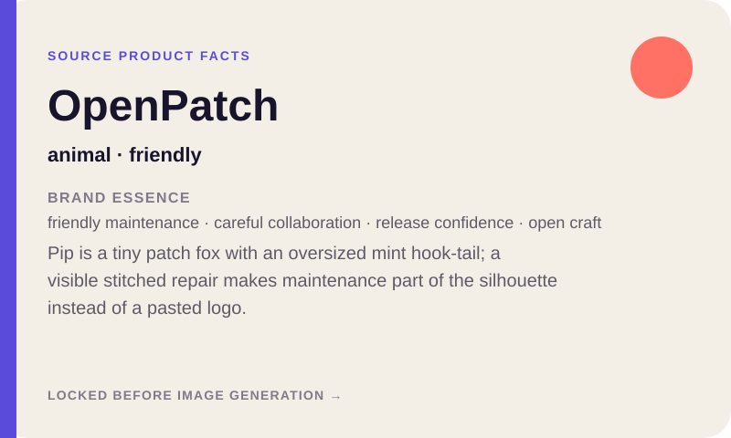
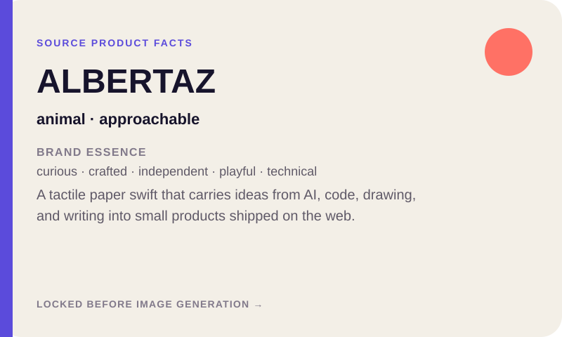
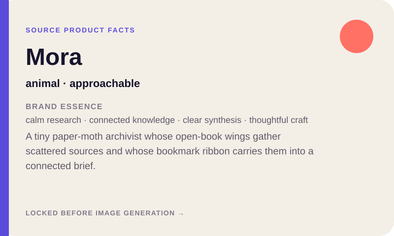

# Product to Mascot examples

## Featured: OpenPatch → Pip

Pip is a tiny patch fox for a fictional open-source maintenance product. Its
oversized mint hook-tail, visible repair patch, and coral stitches make product
meaning part of the silhouette while the oversized head and tiny paws create
the appeal hook.

| **Source product facts** | **Generated five-pose system** |
| :---: | :---: |
|  |  |

[`generated/openpatch-pip/`](generated/openpatch-pip/) contains the V2 character
bible, five full-size pose PNGs, contact sheet, and passing manifest.

## Second approved system: ALBERTAZ → Azi

Azi is a folded-paper swift built from ALBERTAZ's real personal-brand facts.
The A-shaped wing opening, Z-fold tail, and page-turn wing tip encode software,
visual work, and writing without pasting a wordmark onto the character.

| **Source product facts** | **Generated five-pose system** |
| :---: | :---: |
|  |  |

[`generated/albertaz-azi/`](generated/albertaz-azi/) contains the input facts,
three directions, V2 character bible, five full-size pose PNGs, 64 px checks,
contact sheet, and passing manifest.

## Third verified system: Mora → Mori

Mora is a fictional calm research workspace that gathers scattered sources and
turns them into connected briefs. Its original mascot Mori is a tiny paper-moth
archivist: open-book wings express research and a lime bookmark ribbon remains
visible in every pose.

```text
Use $product-to-mascot for Mora, a calm research workspace that gathers
scattered sources and turns them into connected briefs. Create a tiny
paper-moth archivist with open-book wings and a lime bookmark ribbon. Generate
the verified five-pose reference set.
```

## Verified reference set

| **Source product facts** | **Generated five-pose system** |
| :---: | :---: |
|  |  |

[`generated/mora-mori/`](generated/mora-mori/) contains the complete delivery:

```text
character-bible.json
mascot-primary.png  mascot-welcome.png  mascot-working.png
mascot-thinking.png mascot-celebrate.png
mascot-contact-sheet.png
mascot-manifest.json
```

The character bible locks the round indigo body, open-book wing construction,
face rule, coral antenna tips, lime bookmark ribbon, and tactile cut-paper
medium. The five poses cover neutral, welcome, focused work, thinking/help, and
celebration rather than five cosmetic arm variations.

Run `npm run examples` to rebuild the three source briefs and verify the
checked-in Pip, Azi, and Mori contact sheets from their five full-size pose
images. It does not generate an unreviewed replacement character.
