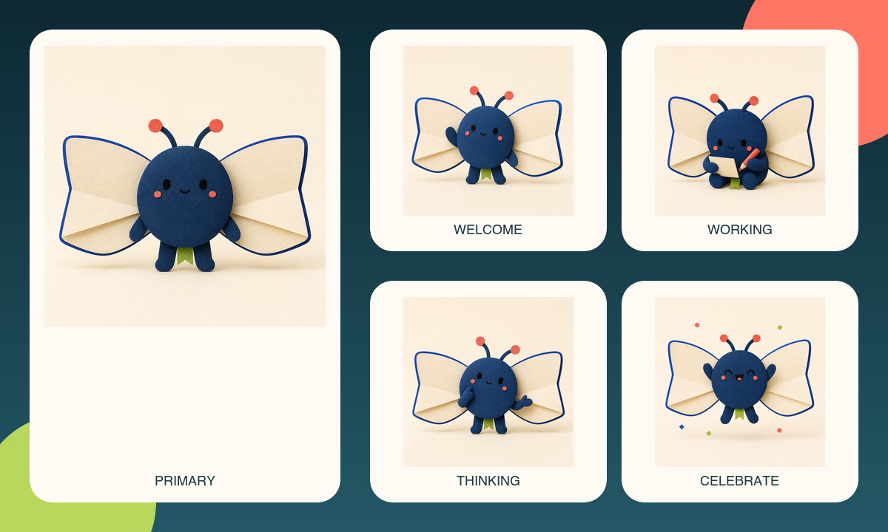
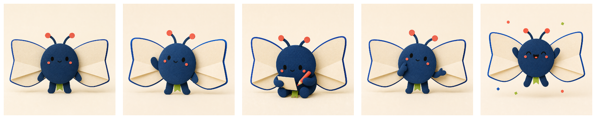

# Product to Mascot example

Mora is a fictional calm research workspace that gathers scattered sources and
turns them into connected briefs. Its original mascot Mori is a tiny paper-moth
archivist: open-book wings express research and a lime bookmark ribbon remains
visible in every pose.

<p align="center">
  
</p>

```text
Use $product-to-mascot for Mora, a calm research workspace that gathers
scattered sources and turns them into connected briefs. Create a tiny
paper-moth archivist with open-book wings and a lime bookmark ribbon. Generate
the verified five-pose reference set.
```

## Verified reference set

<p align="center">
  
</p>

[`generated/mora-mori/`](generated/mora-mori/) contains the complete delivery:

```text
character-bible.json
mascot-primary.png  mascot-welcome.png  mascot-working.png
mascot-thinking.png mascot-celebrate.png
mascot-contact-sheet.png
mascot-manifest.json
```

The character bible locks the round indigo body, open-book wing construction,
face rule, coral antenna tips, lime bookmark ribbon, and tactile cut-paper
medium. The five poses cover neutral, welcome, focused work, thinking/help, and
celebration rather than five cosmetic arm variations.

Run `npm run verify:deliverables` to exercise the deterministic validator or
`scripts/verify-mascot-reference-set.sh examples/generated/mora-mori` to
rebuild and verify this checked-in contact sheet.
